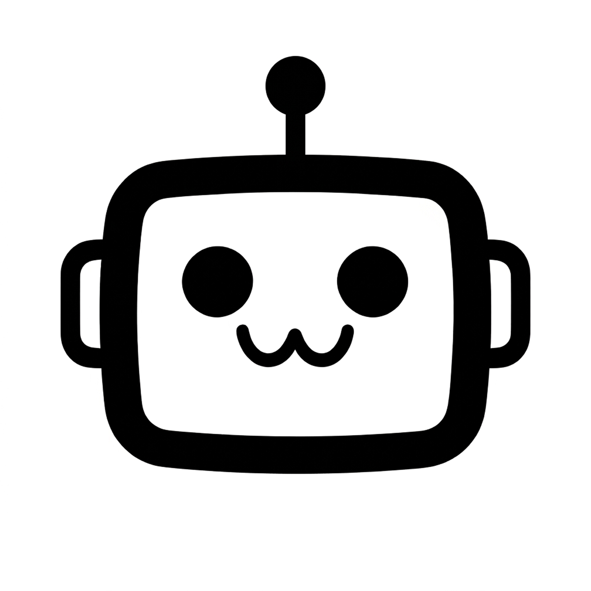
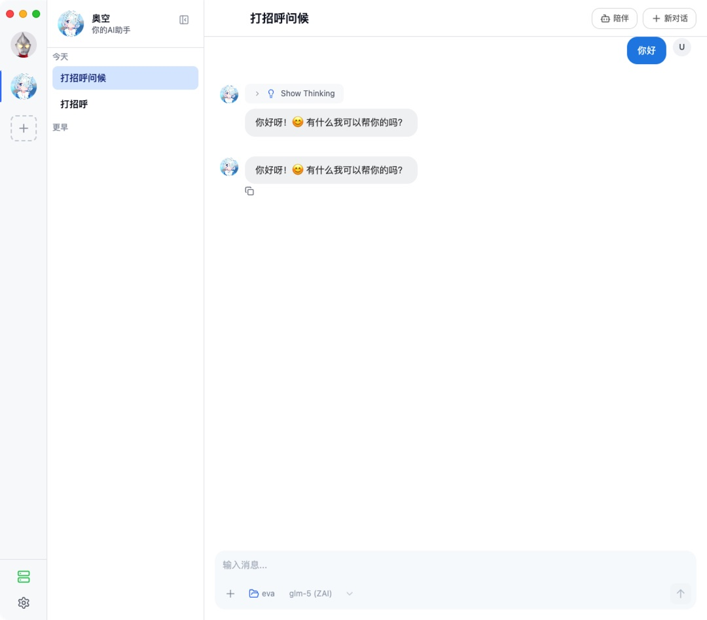
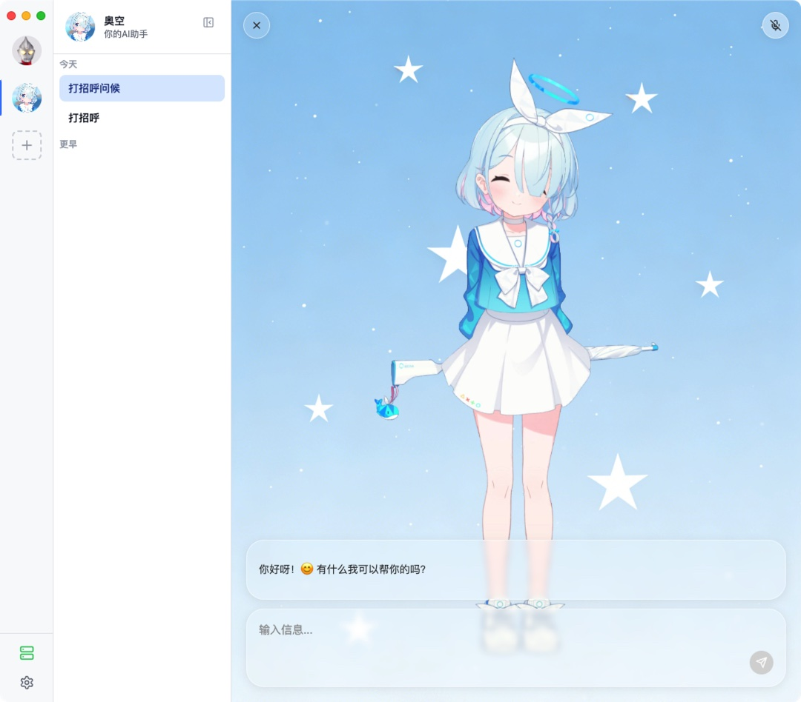

<p align="right">
<a href="README.md">简体中文</a> | English
</p>

<div align="center">



# Persona Agent

[](LICENSE)

[](https://github.com/Code-MonkeyZhang/persona-agent/releases)

</div>

Persona is an open-source personal AI Agent chat platform that lets you give your agents custom personality, voice, and portraits.

Install agents, MCP tools, and Skills from the Agent Marketplace in one click.

## 📷 Preview

<table>
  <tr>
    <td></td>
    <td></td>
  </tr>
</table>

## ✨ Key Features
- **Multi-Agent Management** — Create multiple independent Agents with character settings, model configuration, MCP tools, Agent Skills, and conversation history
- **17 LLM Providers** — DeepSeek, MiniMax, Zhipu, Kimi, Moonshot, OpenAI, Anthropic, Google, OpenRouter, and more
- **Custom Agent Portraits** — Add custom character portraits and backgrounds. Agents automatically switch expressions based on conversation context
- **Voice Synthesis** — TTS voice synthesis powered by MiniMax API
- **MCP & Agent Skills** — Configure custom MCP tools and Agent Skills for each Agent, including OAuth-based MCP services (Notion, GitHub)
- **Remote Access** — Built-in Cloudflare Tunnel for connecting from the mobile app

## 📢 News
- 2026-07-04 — **v1.6.0**: merged multi-step thinking, persistent API error messages, Git Bash on Windows, one-click uv runtime download, optimistic chat loading.
- 2026-06-28 — **v1.5.0**: new Agent Marketplace for browsing and installing skills & MCP tools; unified HTTP error handling; design system rollout.
- 2026-06-23 — **v1.4.0**: redesigned desktop UI (TitleBar + dual sidebars), agent chat with multi-session management, dedicated skill/tool assignment views.
- 2026-06-04 — **v1.2.3**: fixed message leaking and cross-session voice playback on session switch; improved skill path resolution and system prompt editing.

<details>
<summary>Earlier news</summary>

- 2026-05-24 — **v1.2.1**: Windows platform support, bilingual (CN/EN) UI.
- 2026-05-20 — **v1.2.0**: agent portrait & background management, companion panel animations and window drag-region fixes.
- 2026-05-18 — **v1.1.9**: pose management in Agent Editor, window drag support.
- 2026-05-17 — **v1.1.8**: voice cloning, Web Fetch tool, multi-language TTS translation.
- 2026-05-12 — **v1.1.5**: Web Fetch tool, MCP entry, global icon refresh.
- 2026-05-03 — **v1.1.0**: first iterative release, foundational agent architecture and CI/CD.
- 2026-04-27 — **v1.0.x**: first public release of Persona Agent (MVP).

</details>

→ [Full release history](https://github.com/Code-MonkeyZhang/persona-agent/releases)

## 🚀 Quick Start

This project supports macOS and Windows. Download the installer from [GitHub Releases](https://github.com/Code-MonkeyZhang/persona-agent/releases):

| Platform            | File                              |
| ------------------- | --------------------------------- |
| macOS Apple Silicon | `Persona-mac-arm64-{version}.dmg` |
| macOS Intel         | `Persona-mac-x64-{version}.dmg`   |
| Windows x64         | `Persona-win-x64-{version}.exe`   |

Open the DMG file and drag the app to Applications; on Windows, run the exe installer and follow the prompts.

> [!NOTE]
> If you see a "Persona.app is damaged and can't be opened" alert on macOS, run the following command in Terminal:
>
> ```bash
> xattr -cr /Applications/Persona.app
> ```
> After running this command, the app should open normally.
>
> The Windows installer is unsigned, so SmartScreen may show a "Windows protected your PC" warning on first launch. Click "More info" → "Run anyway" to continue.

## 🎨 Agent Customization

Every agent in Persona is one of a kind: portraits, backgrounds, and voice — all defined by you.

### Portraits

Customize character portraits and conversation backgrounds for each agent. The agent automatically switches expressions based on conversation mood.

<table>
  <tr>
    <td align="center"><b>Default</b></td>
    <td align="center"><b>Very Happy</b></td>
    <td align="center"><b>Yandere</b></td>
    <td align="center"><b>Background</b></td>
  </tr>
  <tr>
    <td></td>
    <td></td>
    <td></td>
    <td></td>
  </tr>
</table>

### Voice

Give your agent a voice of its own. Voice synthesis is powered by MiniMax TTS, with a range of preset voices and support for cloning a custom voice from recorded audio.

> 💡 Want more agent templates, skills, and tools? Head to the **Agent Marketplace** below.

## 🛒 Agent Marketplace

Persona ships with a built-in marketplace to browse, install, and manage Agent templates, Skills, and MCP tools in one place. The catalog is driven by the open-source [persona-agent-marketplace](https://github.com/Code-MonkeyZhang/persona-agent-marketplace) repo, and supports one-click install with MCP and Skill assignment to a specific agent.

- **Agents**: curated character templates, ready to use after install
- **Skills**: inject domain knowledge and capabilities into your agents
- **Tools (MCP)**: connect external services like Notion and GitHub, with OAuth support

## 📱 Mobile

Persona also provides an iOS and Android mobile app. Connect to your agent via Cloudflare Tunnel and chat anytime, anywhere.

<table>
  <tr>
    <td align="center"><b>Mobile Demo</b></td>
    <td align="center"><b>Conversation</b></td>
    <td align="center"><b>Agent Details</b></td>
  </tr>
  <tr>
    <td></td>
    <td></td>
    <td></td>
  </tr>
</table>

→ [View Mobile Project](https://github.com/Code-MonkeyZhang/persona-agent-mobile)

## 💜 Acknowledgements

### Reference Projects

- [Chatbox](https://github.com/chatboxai/chatbox) — Cross-platform AI desktop client
- [Cherry Studio](https://github.com/CherryHQ/cherry-studio) — Full-featured AI assistant with multi-provider LLM support
- [Halo](https://github.com/openkursar/hello-halo) — 24/7 autonomous desktop AI Agent with digital human avatar system
- [OpenCode](https://github.com/anomalyco/opencode) — AI coding tool, important reference for architecture and build system
- [ZcChat](https://github.com/Zao-chen/ZcChat) — Desktop AI companion with Galgame-style character portraits and voice interaction

### Technical Dependencies

- [pi-ai](https://github.com/mariozechner/pi-ai) — Unified multi-provider LLM API
- [Model Context Protocol](https://modelcontextprotocol.io/) — MCP tool extension protocol
- [Cloudflare Tunnel](https://developers.cloudflare.com/cloudflare-one/connections/connect-networks/) — Secure tunneling for remote access
- [MiniMax](https://www.minimaxi.com/) — TTS voice synthesis
