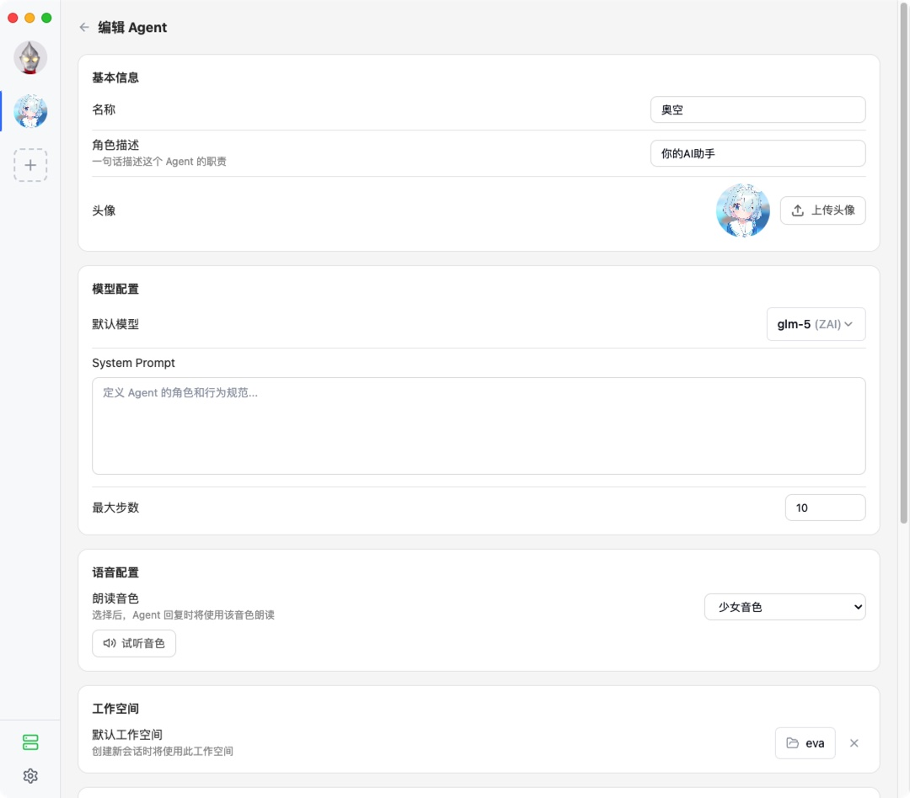
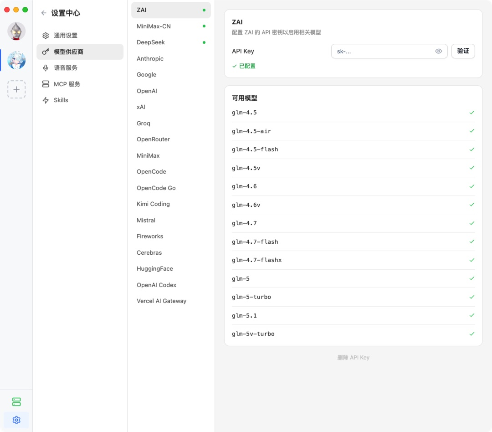

<div align="center">


# Persona Agent

**你的本地 AI Agent 工作站**

创建和管理多个 AI Agent，赋予它们工具、技能和性格，让它们帮你完成任务。

[](LICENSE)

[](https://github.com/Code-MonkeyZhang/persona-agent/releases)

</div>

## 截图


<!--  -->

<!--  -->

## 核心功能

- **多 Agent 管理** — 创建多个独立 Agent，每个有自己的角色设定、模型配置和会话历史，互不干扰
- **17+ 模型供应商** — OpenAI、Anthropic、Google、DeepSeek、MiniMax、xAI、Groq、Mistral、OpenRouter、Cerebras、Fireworks 等，每个 Agent 独立配置默认模型，每个会话可以临时切换
- **工具调用** — 内置工具（执行命令、读写文件），MCP 协议连接外部工具服务器，Skill 加载获得专业知识
- **流式对话** — 完整 Markdown 渲染，代码块一键复制，推理过程和工具调用细节可展开查看
- **Agent 形象** — 全屏展示角色立绘，Agent 根据对话自动切换表情，配合语音合成朗读回复
- **远程访问** — 内置 Cloudflare Tunnel，一键把本地服务暴露到公网，从手机或其它设备远程访问
- **跨平台** — macOS（Apple Silicon / Intel）、Windows x64，下载即用，无需安装运行时

## 下载安装

前往 [GitHub Releases](https://github.com/Code-MonkeyZhang/persona-agent/releases) 下载对应平台的安装包：

| 平台 | 文件 |
|------|------|
| macOS Apple Silicon | `Persona-mac-arm64-{version}.dmg` |
| macOS Intel | `Persona-mac-x64-{version}.dmg` |
| Windows x64 | `Persona-win-x64-{version}.exe` |

macOS 打开 DMG 拖入 Applications，Windows 运行 exe 安装即可。

## 快速开始

1. 从 [Releases](https://github.com/Code-MonkeyZhang/persona-agent/releases) 下载并安装
2. 打开应用，进入 Settings → Model Providers，填入至少一个供应商的 API Key 并验证
3. 点击左侧栏的「+」创建 Agent，填写名称、人设，选择模型
4. 开始对话

## 从源码构建

需要 [Bun](https://bun.sh/) 1.0+ 和 Node.js 18+。

```bash
# 安装依赖
cd packages/server && bun install
cd packages/desktop && npm install

# 开发模式（编译 server + 启动 Electron 开发服务器）
npm run dev

# 构建安装包
npm run dist          # 当前平台
npm run dist:mac      # macOS
npm run dist:win      # Windows
```

其他命令：

```bash
npm run typecheck     # 类型检查
npm run lint          # 代码检查
npm run format        # 格式化
npm run check         # 一键检查（lint + format + typecheck）
```

### 测试

```bash
cd packages/server && bun test
cd packages/desktop && npm run test
```

Server 的集成测试需要配置环境变量：

```bash
cd packages/server
cp .env.test.example .env.test.local
# 编辑 .env.test.local，填入 API Key
```

不配置时集成测试会自动跳过，其他测试不受影响。

## 项目结构

```
persona-agent/
├── package.json              # 根编排脚本
├── packages/
│   ├── server/               # 后端服务（Bun）
│   │   └── src/
│   │       ├── agent/        # Agent 运行时、配置存储
│   │       ├── session/      # 会话管理、消息持久化
│   │       ├── server/       # HTTP/WebSocket、路由、隧道
│   │       ├── tools/        # 内置工具
│   │       ├── mcp/          # MCP 协议连接
│   │       ├── skill/        # Skill 加载
│   │       ├── auth/         # API Key 管理
│   │       └── converters/   # LLM 响应格式转换
│   └── desktop/              # 桌面客户端（Electron + React）
│       └── src/
│           ├── main/         # 主进程
│           ├── preload/      # 预加载脚本
│           └── renderer/     # React 前端
```

## 用户数据目录

| 平台 | 路径 |
|------|------|
| macOS | `~/.local/share/persona-agent/` |
| Windows | `%APPDATA%/persona-agent/` |

```
persona-agent/
├── config/              # 全局配置、API Key
├── agents/{id}/         # Agent 配置、资源、会话
├── skills/              # 自定义 Skill
├── mcp/                 # MCP 服务器配置和运行时数据
└── logs/                # 运行日志
```

## 致谢

### 参考项目

- [Chatbox](https://github.com/chatboxai/chatbox) — 跨平台 AI 桌面客户端
- [Cherry Studio](https://github.com/CherryHQ/cherry-studio) — 全功能 AI 助手，多供应商 LLM 支持
- [Halo](https://github.com/openkursar/hello-halo) — 24/7 自主桌面 AI Agent，数字人形象系统
- [OpenCode](https://github.com/anomalyco/opencode) — AI 编程工具，本项目架构与构建体系的重要参考
- [ZcChat](https://github.com/Zao-chen/ZcChat) — 桌面 AI 伴侣，Galgame 风格角色立绘与语音交互

### 技术依赖

- [Bun](https://bun.sh/) — Server 运行时，单文件编译分发
- [Electron](https://www.electronjs.org/) — 跨平台桌面应用框架
- [React](https://react.dev/) — UI 框架
- [pi-ai](https://github.com/mariozechner/pi-ai) — 统一多供应商 LLM 调用接口
- [Model Context Protocol](https://modelcontextprotocol.io/) — 工具扩展协议
- [Cloudflare Tunnel](https://developers.cloudflare.com/cloudflare-one/connections/connect-networks/) — 内网穿透
- [MiniMax](https://www.minimaxi.com/) — TTS 语音合成

## License

[MIT](LICENSE)
