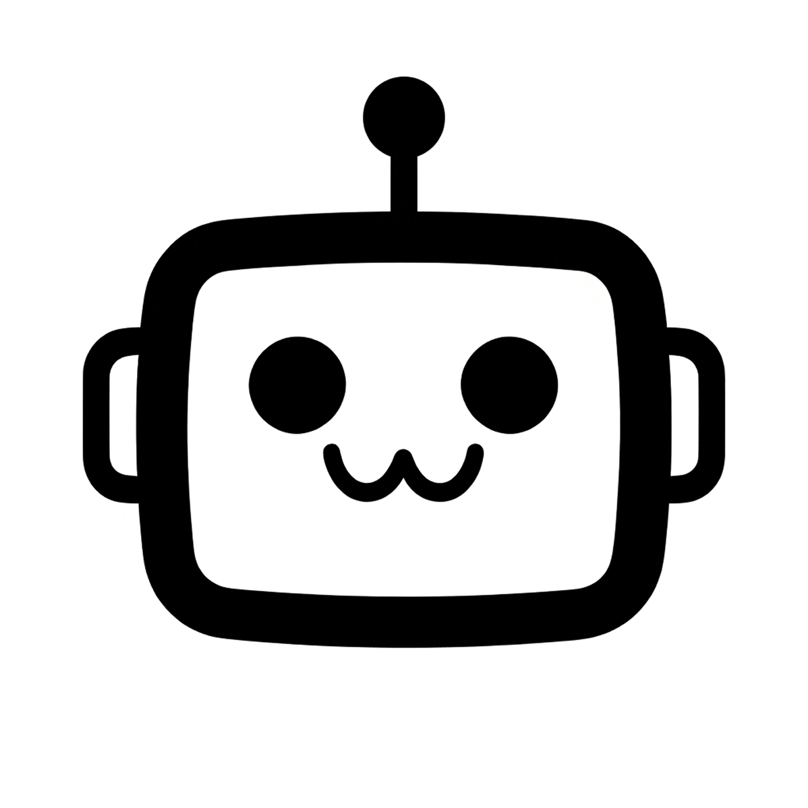
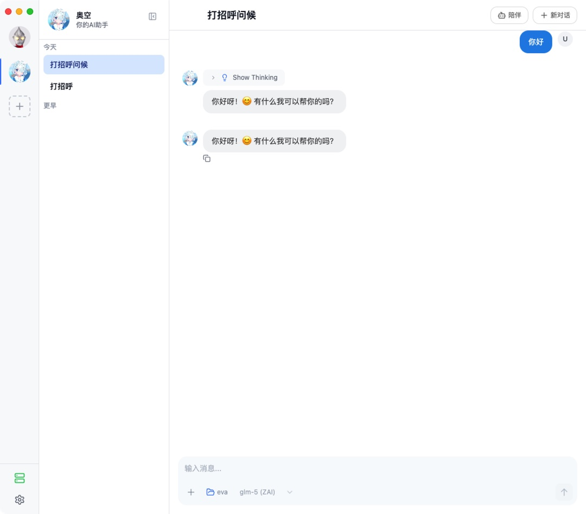
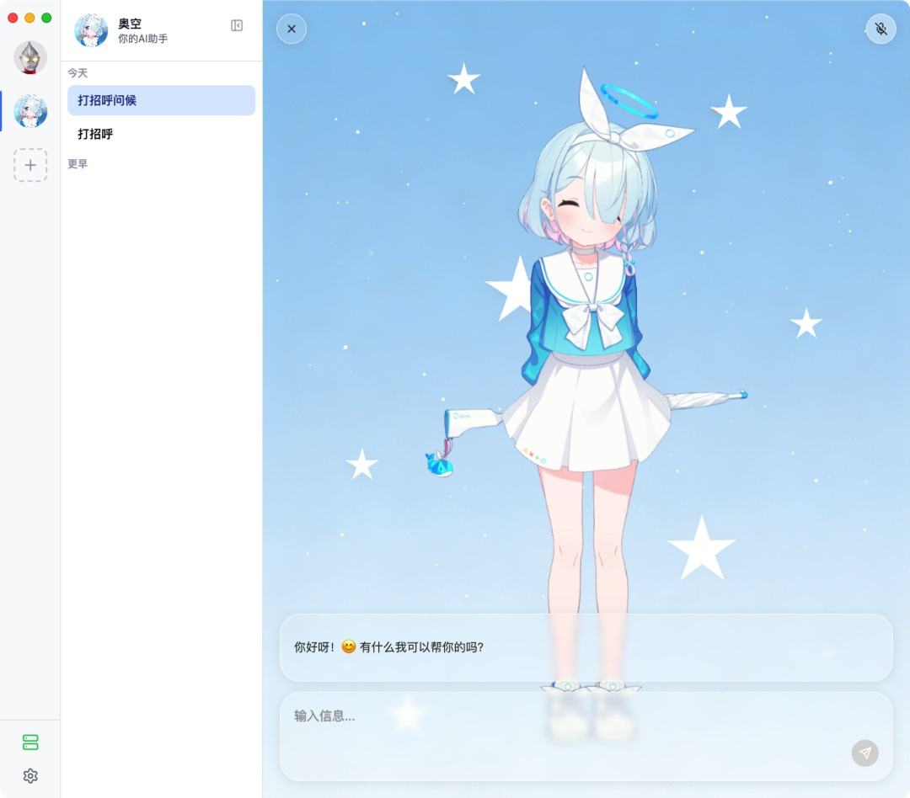

<div align="center">



# Persona Agent

**属于你自己的AI Agent**

创建和管理多个 AI Agent，赋予它们形象和性格, 工具、技能，让成为你生活的帮手!

[](LICENSE)

[](https://github.com/Code-MonkeyZhang/persona-agent/releases)

</div>

## 演示

<table>
  <tr>
    <td align="center"><b>主界面</b></td>
    <td align="center"><b>Agent 形象</b></td>
  </tr>
  <tr>
    <td></td>
    <td></td>
  </tr>
</table>

## 核心功能

- **自定义自己的Agent 形象** — 支持自定义Agent的角色立绘和声音，Agent 会根据对话自动切换表情，配合语音合成回复, 让你的智能体栩栩如生!
- **多 Agent 管理** — 创建多个独立 Agent，每个有自己的角色设定、模型配置MCP、Agent Skill以及会话历史
- **17+ 模型供应商支持** — DeepSeek、MiniMax、智谱、Kimi、OpenAI、Anthropic、Google、OpenRouter等多供应商支持
- **MCP与Skill支持** — 支持自定义给每个Agent自定义MCP工具和Agent Skill
- **远程访问** — 内置 Cloudflare Tunnel，从通过手机App远程调用!

## 下载安装

本项目支持macOS平台, Windows 版本正在开发中. 前往 [GitHub Releases](https://github.com/Code-MonkeyZhang/persona-agent/releases) 下载对应平台的安装包：

| 平台                | 文件                              |
| ------------------- | --------------------------------- |
| macOS Apple Silicon | `Persona-mac-arm64-{version}.dmg` |
| macOS Intel         | `Persona-mac-x64-{version}.dmg`   |

macOS 打开 DMG 拖入 Applications 即可。

## 自定义 Agent

### 资源目录

| 平台  | 路径                            |
| ----- | ------------------------------- |
| macOS | `~/.local/share/persona-agent/` |

```
persona-agent/
├── config/              # 全局配置、API Key
├── agents/{id}/         # Agent 配置、资源、会话
│   ├── config.json      # Agent 配置（名称、人设、模型等）
│   ├── portrait.png     # 角色立绘（默认表情）
│   ├── portrait-{expression}.png  # 其他表情立绘
│   └── background.png   # 对话背景图片
├── skills/              # 自定义 Skill
├── mcp/                 # MCP 服务器配置和运行时数据
└── logs/                # 运行日志
```

### Agent 形象

Persona 支持为每个 Agent 自定义角色立绘和对话背景图片。立绘会根据对话情绪自动切换对应表情。

<table>
  <tr>
    <td align="center"><b>默认</b></td>
    <td align="center"><b>非常喜欢</b></td>
    <td align="center"><b>病娇</b></td>
    <td align="center"><b>背景</b></td>
  </tr>
  <tr>
    <td></td>
    <td></td>
    <td></td>
    <td></td>
  </tr>
</table>

**立绘要求：**

- 格式：PNG，推荐透明背景
- 建议尺寸：约 1000 × 2100
- 文件命名：要求必须有一个默认表情`default.png`、其他表情可以随意命名`{expression}.png`
- 放置路径：`agents/{agent-id}/portrait.png`

**背景要求：**

- 格式：PNG
- 建议尺寸：约 1500 × 2700
- 放置路径：`agents/{agent-id}/background.png`

> 更多 Agent 形象资源，会在 [GitHub Discussions](https://github.com/Code-MonkeyZhang/persona-agent/discussions) 分享！

## 让你的Agent活跃在移动端

Persona 还提供iOS 和 Android的移动端app，通过Cloudflare Tunnel连接你的智能体，随时随地与 Agent 对话。

<table>
  <tr>
    <td align="center"><b>移动端演示</b></td>
    <td align="center"><b>普通对话</b></td>
    <td align="center"><b>Agent 详情</b></td>
  </tr>
  <tr>
    <td></td>
    <td></td>
    <td></td>
  </tr>
</table>

→ [查看移动端项目](https://github.com/Code-MonkeyZhang/persona-agent-mobile)

## Contact

本项目由 [Zhang Yufeng](https://github.com/Code-MonkeyZhang) 个人开发维护。如有问题、想法或合作意向，欢迎联系 [yufengzhang483@gmail.com](mailto:yufengzhang483@gmail.com)。

## 致谢

### 参考项目

- [Chatbox](https://github.com/chatboxai/chatbox) — 跨平台 AI 桌面客户端
- [Cherry Studio](https://github.com/CherryHQ/cherry-studio) — 全功能 AI 助手，多供应商 LLM 支持
- [Halo](https://github.com/openkursar/hello-halo) — 24/7 自主桌面 AI Agent，数字人形象系统
- [OpenCode](https://github.com/anomalyco/opencode) — AI 编程工具，本项目架构与构建体系的重要参考
- [ZcChat](https://github.com/Zao-chen/ZcChat) — 桌面 AI 伴侣，Galgame 风格角色立绘与语音交互

### 技术依赖

- [pi-ai](https://github.com/mariozechner/pi-ai) — 统一多供应商 LLM 调用接口
- [Model Context Protocol](https://modelcontextprotocol.io/) — MCP工具扩展协议
- [Cloudflare Tunnel](https://developers.cloudflare.com/cloudflare-one/connections/connect-networks/) — 提供内网穿透能力
- [MiniMax](https://www.minimaxi.com/) — TTS 语音合成
