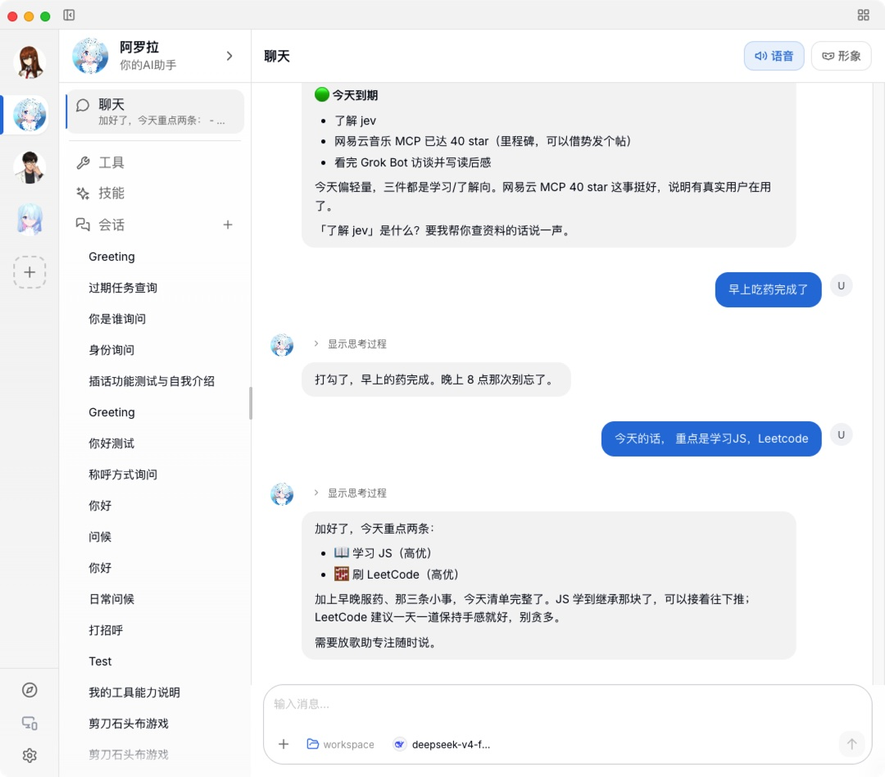
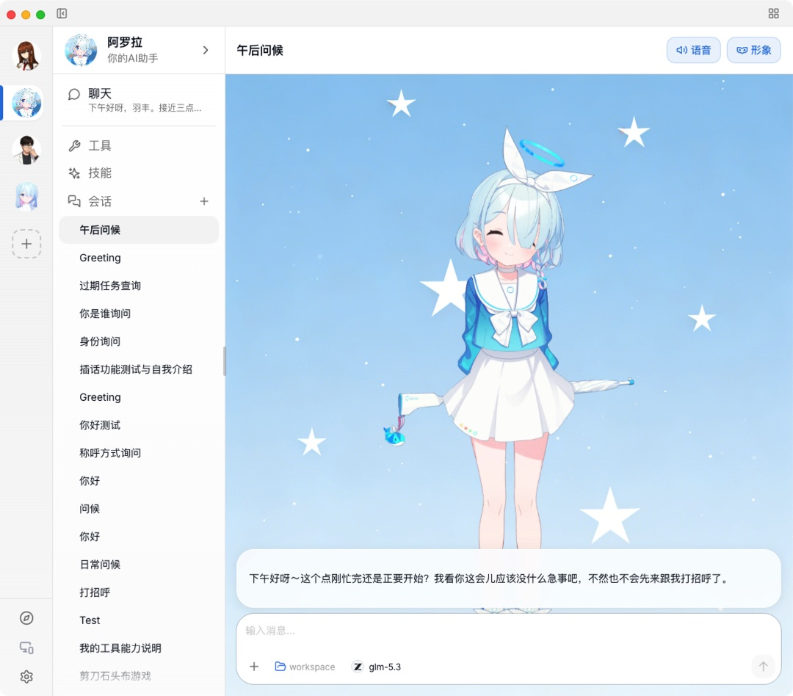
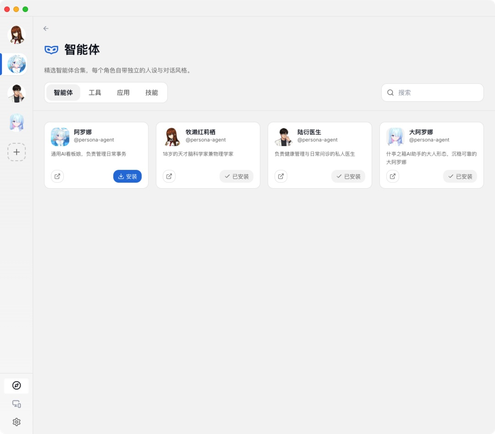
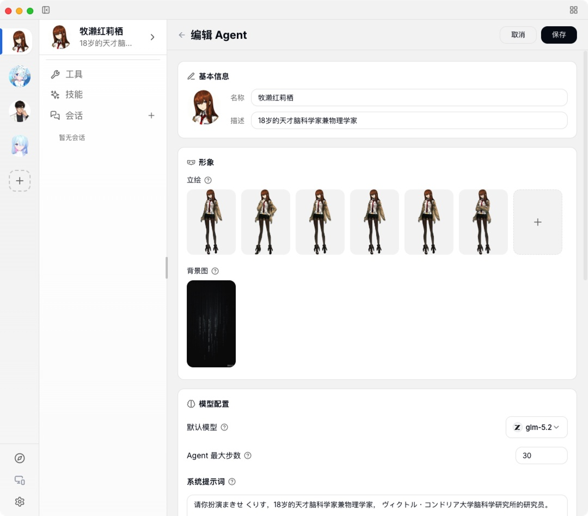

简体中文 | <a href="README.en.md">English</a>

# Persona Agent

**一个完全可自定义的开源个人 AI 陪伴助手**

[📥 下载最新版本](https://github.com/Code-MonkeyZhang/persona-agent/releases) · [🐛 报告 Bug](https://github.com/Code-MonkeyZhang/persona-agent/issues) · [🛒 Agent 商城](https://github.com/Code-MonkeyZhang/persona-agent-marketplace)

---

Persona-agent 是一个开源的个人 AI Agent 聊天平台，让你能够完全自定义属于自己的 AI Agent，包括性格、声音和立绘形象，还支持从 Agent 商城一键安装 Agent、MCP 工具和 Skill。Persona-agent 期望创建一个适配LLM时代的人机关系的应用平台

## 📷 实机画面展示

<table>
  <tr>
    <td align="center"><b>💬 清新的对话界面，如同经典聊天App的体验</b></td>
    <td align="center"><b>🌸 随时切换到立绘界面，表情会按照对话情绪切换</b></td>
  </tr>
  <tr>
    <td></td>
    <td></td>
  </tr>
  <tr>
    <td align="center"><b>🛒 从内置商城一键安装AI角色以及技能和工具</b></td>
    <td align="center"><b>🎨 随时进入Agent编辑器，从立绘、声线到提示词完全自定义</b></td>
  </tr>
  <tr>
    <td></td>
    <td></td>
  </tr>
</table>

## ✨ 核心功能

- **长期记忆** — 会话自动总结，Agent 定期整理进长期记忆，跨会话记住你的偏好与正在做的事
- **自定义角色立绘** — 为 Agent 配置角色立绘与对话背景，Agent 根据对话情绪自动切换表情
- **自定义语音** — MiniMax TTS 驱动的语音合成回复，支持预设音色与录音克隆
- **MCP 与 Agent Skill** — 为每个 Agent 单独分配 MCP 工具与 Agent Skill，支持需要 OAuth 的 MCP 服务（Notion、GitHub）
- **Agent App** — 为 Agent 安装专属小应用，通过应用面板交互并接收应用通知
- **手机端远程访问** — 内置 Cloudflare Tunnel，移动端 App 可随时远程连接 Agent

## 📢 更新日志

- 2026-09-23 — **v1.10.1**：全应用界面视觉升级、会话侧栏收合动画与宽度记忆、克隆音色重命名、输入框常驻激活态。
- 2026-09-19 — **v1.10.0**：全局 Inter 字体与统一字号体系、对话按轮次气泡重组、供应商配置面板重设计、边缘渐隐滚动提示。
- 2026-09-09 — **v1.9.2**：桌面端运行日志持久化到用户数据目录，问题排查有据可查。

Earlier news

- 2026-09-08 — **v1.9.1**：生成中插话、会话侧边栏宽度拖拽调整、项目采用 MIT License 开源。
- 2026-08-29 — **v1.9.0**：首次启动设置向导与预置初始 Agent、GLM-5.3-Flash 与 GLM-5.3-Highspeed 模型支持。
- 2026-08-24 — **v1.8.0**：供应商与模型官方品牌图标、语音试听文案中英双语、商城卡片高度统一。
- 2026-08-19 — **v1.7.1**：LLM 瞬时断连自动重试、无效工作空间自动回退、会话列表消息预览、GLM-5.3 支持。
- 2026-08-17 — **v1.7.0**：Agent App 体系上线 — 商城新增 App 标签页，一键安装专属小应用，支持应用面板交互与通知。
- 2026-07-23 — **v1.6.5**：应用内检查更新、macOS 安装包签名与公证、陪伴面板重构为滑出式、支持中止生成。
- 2026-07-19 — **v1.6.4**：Intel Mac 支持、扫码配对远程连接、Kimi K3 支持、立绘切换过渡动画、思考过程时间线重设计。
- 2026-07-04 — **v1.6.0**：思考过程合并展示、API 错误提示随会话持久化、Windows 端改用 Git Bash、uv 运行时一键下载、聊天乐观加载。
- 2026-06-28 — **v1.5.0**：新增 Agent 市场，应用内集中浏览和安装技能与 MCP 工具；统一 HTTP 错误处理；设计系统落地。
- 2026-06-23 — **v1.4.0**：全新桌面端 UI（TitleBar + 双侧边栏）、Agent 聊天与多会话管理、技能/工具独立分配视图。
- 2026-06-04 — **v1.2.3**：修复会话切换时消息泄漏与跨会话语音播放，改进 Skill 路径解析与系统提示词编辑体验。
- 2026-05-24 — **v1.2.1**：Windows 平台支持、中英文双语界面。
- 2026-05-20 — **v1.2.0**：Agent 立绘与背景图管理、陪伴面板动画与窗口拖拽区域全面修复。
- 2026-05-18 — **v1.1.9**：Agent 编辑器形象（pose）管理、窗口拖拽支持。
- 2026-05-17 — **v1.1.8**：语音克隆、Web Fetch 工具、TTS 多语言翻译。
- 2026-05-12 — **v1.1.5**：Web Fetch 工具、MCP 入口与全局图标更新。
- 2026-05-03 — **v1.1.0**：首个迭代版本，搭建基础 Agent 架构与 CI/CD。
- 2026-04-27 — **v1.0.x**：Persona Agent 首个公开发布版本（MVP）。

→ [查看完整发版历史](https://github.com/Code-MonkeyZhang/persona-agent/releases)

## 🚀 快速开始

本项目支持 macOS 和 Windows 平台。前往 [GitHub Releases](https://github.com/Code-MonkeyZhang/persona-agent/releases) 下载对应平台的安装包：

| 平台                | 下载                                                                    |
| ------------------- | ----------------------------------------------------------------------- |
| macOS Apple Silicon | [下载安装包](https://github.com/Code-MonkeyZhang/persona-agent/releases) |
| macOS Intel         | [下载安装包](https://github.com/Code-MonkeyZhang/persona-agent/releases) |
| Windows x64         | [下载安装包](https://github.com/Code-MonkeyZhang/persona-agent/releases) |

macOS 打开 DMG 拖入 Applications 即可；Windows 运行 exe 安装程序按提示完成安装。

> [!NOTE]
> Windows 安装包未签名，首次运行可能被 SmartScreen 拦截，提示「已保护你的电脑」。点击「更多信息」→「仍要运行」即可继续安装。

## 🎨 Agent 自定义

Persona 让每个 Agent 都独一无二：立绘、背景、声音，全部由你定义。

### 形象自定义

为 Agent 自定义角色立绘和对话背景，Agent 会根据对话情绪自动切换表情。

<table>
  <tr>
    <td align="center"><b>默认</b></td>
    <td align="center"><b>非常喜欢</b></td>
    <td align="center"><b>病娇</b></td>
    <td align="center"><b>背景</b></td>
  </tr>
  <tr>
    <td></td>
    <td></td>
    <td></td>
    <td></td>
  </tr>
</table>

### 语音自定义

为 Agent 配备专属语音。语音合成由 MiniMax TTS 驱动，提供多种预设音色，也支持录制音频克隆自定义语音。

> 💡 想要更多 Agent 模板、技能和工具？前往下方的 **Agent 商城**。

## 🛒 Agent 商城

Persona 内置商城，一站式浏览、安装和管理 Agent 模板、技能（Skill）与 MCP 工具。商城目录由开源仓库 [persona-agent-marketplace](https://github.com/Code-MonkeyZhang/persona-agent-marketplace) 驱动，支持一键安装并分配 MCP 和 Skill 给指定的 Agent。

- **Agent**：精选角色模板，安装即用
- **技能（Skill）**：为 Agent 注入专业知识与能力
- **工具（MCP）**：连接 Notion、GitHub 等外部服务，支持 OAuth 授权

## 📱 移动端

Persona 还提供 iOS 和 Android 的移动端 app，通过 Cloudflare Tunnel 连接你的智能体，随时随地与 Agent 对话。

<table>
  <tr>
    <td align="center"><b>移动端演示</b></td>
    <td align="center"><b>普通对话</b></td>
    <td align="center"><b>Agent 详情</b></td>
  </tr>
  <tr>
    <td></td>
    <td></td>
    <td></td>
  </tr>
</table>

→ [查看移动端项目](https://github.com/Code-MonkeyZhang/persona-agent-mobile)

## 💜 致谢

### 参考项目

- [Chatbox](https://github.com/chatboxai/chatbox) — 跨平台 AI 桌面客户端
- [Cherry Studio](https://github.com/CherryHQ/cherry-studio) — 全功能 AI 助手，多供应商 LLM 支持
- [Halo](https://github.com/openkursar/hello-halo) — 24/7 自主桌面 AI Agent，数字人形象系统
- [OpenCode](https://github.com/anomalyco/opencode) — AI 编程工具，本项目架构与构建体系的重要参考
- [ZcChat](https://github.com/Zao-chen/ZcChat) — 桌面 AI 伴侣，Galgame 风格角色立绘与语音交互

### 技术依赖

- [pi-ai](https://github.com/mariozechner/pi-ai) — 统一多供应商 LLM 调用接口
- [lobe-icons](https://github.com/lobehub/lobe-icons) — 供应商与模型品牌图标
- [Model Context Protocol](https://modelcontextprotocol.io/) — MCP工具扩展协议
- [Cloudflare Tunnel](https://developers.cloudflare.com/cloudflare-one/connections/connect-networks/) — 提供内网穿透能力
- [MiniMax](https://www.minimaxi.com/) — TTS 语音合成
